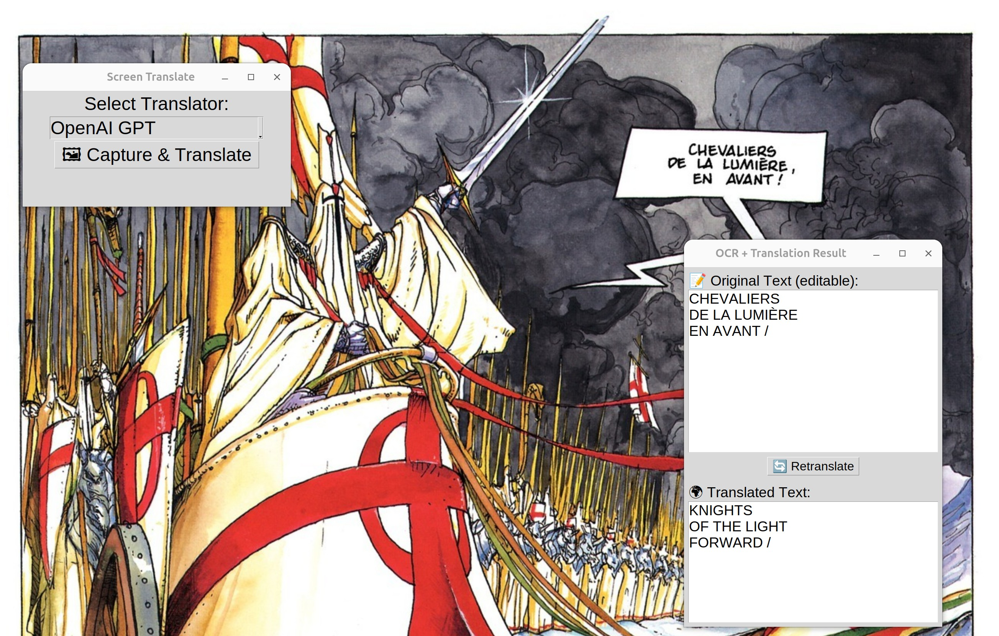

# Screen Translate

A Python tool to capture a selected screen region on GNOME, extract text using Tesseract OCR (French by default), and translate it using either OpenAI GPT or Google Translate API.  
Includes a Tkinter GUI for easy use and editable translation results.

---

## Features

- Region capture using `gnome-screenshot`
- Image preprocessing for improved OCR accuracy
- OCR with Tesseract (default language French)
- Translation via OpenAI GPT or Google Translate API
- Editable original text with re-translation option
- DPI scaling support based on monitor config

---

## Installation

Make sure you have the required system dependencies and Python packages installed.

### System dependencies (Debian/Ubuntu)

```bash
sudo apt update
sudo apt install python3-pip python3.13-venv python3-tk gnome-screenshot tesseract-ocr tesseract-ocr-fra
```

- Replace `tesseract-ocr-fra` with your source language pack if needed (see notes below).

### Python environment setup

```bash
python3 -m venv venv
source venv/bin/activate
pip install --upgrade pip
pip install \
    pillow \
    pytesseract \
    opencv-python-headless \
    numpy \
    requests \
    python-dotenv \
    openai \
    tk
```

---

## Configuration

### `.env` file

Create a `.env` file in the project root with your API keys:

```env
OPENAI_API_KEY=xxx-your-openai-key-xxx
GOOGLE_API_KEY=xxx-your-google-translate-key-xxx
```

Make sure to replace the placeholders with your actual API keys.

---

### Language settings

By default, the script is set to:

```python
SOURCE_LANG = 'fra'  # Tesseract language code (e.g. 'fra' for French, 'eng' for English)
TARGET_LANG_OPEN_AI = "English"  # Target language for OpenAI GPT translation
TARGET_LANG_GOOGLE_TRANSLATE = "en"  # Target language for Google Translate API
```

You can change these variables in the script to your preferred source and target languages. Examples:

```python
SOURCE_LANG = 'eng'  # English OCR
TARGET_LANG_OPEN_AI = "Spanish"
TARGET_LANG_GOOGLE_TRANSLATE = "es"
```

Make sure you have installed the corresponding Tesseract language pack, e.g.:

```bash
sudo apt install tesseract-ocr-eng
```

---

### OpenAI Model & Translation Prompt

The current OpenAI translation uses the `gpt-4o` model with a prompt designed for comic-style text preserving tone and humor:

```python
model="gpt-4o"

prompt = (
    f"Translate the following comic-style text to {target_lang}. Preserve any tone, humor, or emotion.\n\n"
    f"Text:\n{text}\n\n"
    f"Translation:"
)
```

Feel free to adjust the model or prompt in the `translate_with_chatgpt()` function to suit your use case.

---

## Usage

Run the script:

```bash
python3 screen_translate.py
```

- Select your preferred translator in the GUI dropdown.
- Click **Capture & Translate** and select the screen region.
- The extracted text and translation will appear in a popup window.
  - You can edit the OCR-extracted text in the top field if corrections are needed.
  - Then click **🔄 Retranslate** to get an updated translation based on your edits.

---

## Example

Below is an example of the GUI in action:



---

## Notes

- This tool currently works on GNOME/Linux environments due to reliance on `gnome-screenshot` and `.config/monitors.xml` for DPI scaling.
- If you want to add support for other desktop environments or OS, adapt the screenshot method and scaling retrieval accordingly.
- Error handling is basic — check console output for issues.
- The code was generated and refined with the help of ChatGPT.

---

## License

MIT License

---

## Acknowledgements

- [Tesseract OCR](https://github.com/tesseract-ocr/tesseract)
- [OpenAI API](https://openai.com/api/)
- [Google Translate API](https://cloud.google.com/translate)
- [ChatGPT](https://chat.openai.com/) for code generation assistance


🤖 Generated with ChatGPT
This codebase was generated and refined using ChatGPT-4 to speed up prototyping and development.